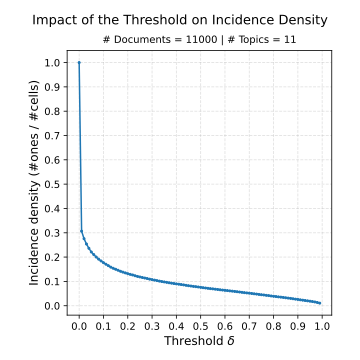
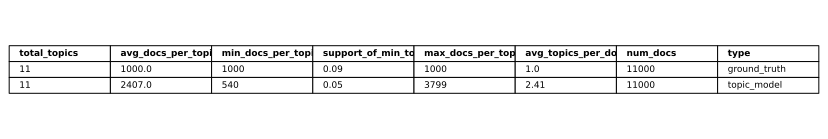
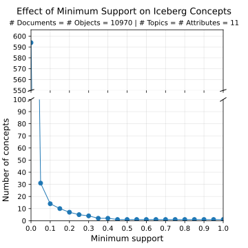
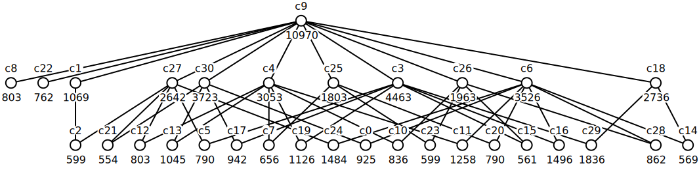
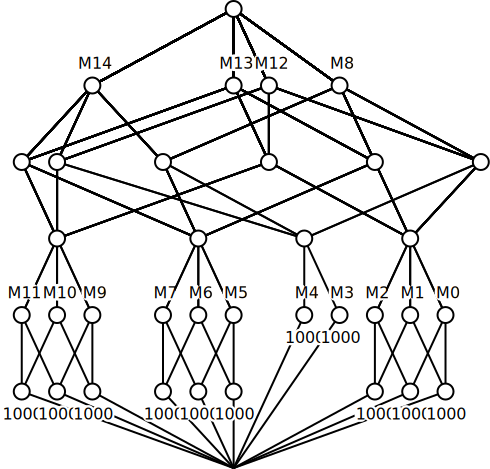
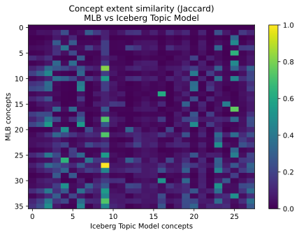
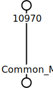

# FCA constrained hierarchical clustering
This repository contains theoretical work, along with work-in-progress practical components, on aligning constraint-based hierarchical clusters with formal contexts. 
The foundational work on hierarchical clustering with constraints is presented in ["Hierarchical constraints: Providing structural bias for hierarchical clustering" (2013)](https://link.springer.com/article/10.1007/s10994-013-5397-9).
Formal contexts follow the standard definitions used in Formal Concept Analysis (FCA).


## Code
Use Python 3.11.14 (`gensim` is known to have [issues](https://www.linkedin.com/posts/01mayank_gensim-python-nlp-activity-7393890618575556608-Qh4b) with Python 3.14 as of December 2025).
Create virtual environment and install dependencies:
```bash
python3.11 -m venv .venv
source .venv/bin/activate
pip install -r requirements.txt
```

### Topic Model 
You can represent texts via their most representive topic.
This topic can be derived from a Topic Model (here: LDA).
Run `dataset2lda_topics.py` in order to obtain **topics**.
You need to define a `MIN_TOPIC_PROB` which is the threshold that decides whether a topic fits a document or not.
In order to get a feeling which value is fitting run `lda_threshold_plots.py`.
You'll obtain plots like the one below which help you make informed choices about the threshold.



Given this plot, a reasonable threshold would `0.05`, because it ensures the document-topic incidence is sparse (i.e.,  incidence density just above `0.2`) and in terms of the elbow criterium.

Now, we've created a json file with the information which document has which topics, which are represented by which words.
However, as of now, we only need the document-topic incidence.
Thus, run `document_representation.py` to create a document-topic **context** json file.

Next, we want to compare the topics from the topic model to the ground truth.
Hence, run `print_stats.py`, which will produce a csv file that below.



We use the resulting document-topic context to extract topic hierarchies using iceberg lattices via the TITANIC algorithm.
Iceberg lattices contain only concepts `(A,B)` whose intent has a support higher or equal to `min_supp`.
Intuively, remaining concepts are document-topic pairs, whose topics are representative for at least `min_supp` $\times 100 \%$ of the documents in the corpus. 
To get a feeling for the choice of `min_supp` we run `plot_concepts_vs_support.py`, resulting in the following plot.



We find that the `min_supp` value should be no lower then `0.15`, otherwise less than `10` concepts remain.
We choose `0.05` and obtain around `30`concepts.

Using this knowledge run the `run_clj_file.py` file after adjusting the `min_supp` value accordingly.
This generates a `.cxt` and an `.edn` file containing the iceberg context and icebergs concepts, respectively.
You may now plot the resulting iceberg concepts lattice by running `plot_concept_lattice.py`.


### MLB Constraints
The MLB constraints have the format `x,y,z` where `x` and `y` have to be meregd before `z`.
If there is no explicit topic id for any of `x`, `y` or `z`, it is the union of its children. 
For instance, if `x` and `y` have explicit names, but `z` has not, `z=x,y`; leading to: `x,y, x,y`

## Comparison of MLB and topic model context

Given the context's concepts as `.edn` files, we can compare the concepts of the topic model iceberg context with the 
concepts of 
the MLB context.
Both Hasse diagrams are plotted and saved running `src/context_comparison/run_clj_file.py` and are shown below.
Additional statistics are also generated when running that file.

Topic Model Iceberg Lattice of the BankSearch Dataset with min-support of 0.05:


Concepts Lattice of the MLB context on the BankSearch Dataset:


# Comparison of the two lattices
Run `src/context_comparison/compare_concepts.py`, `src/context_comparison/run_clj_file.py` and `src/context_comparison/explore_cxt.py`.

`compare_concepts.py` produces (among other things) a heatmap of the similarity between the concepts of the two 
contexts, which is shown below. Similarity is calculated via the Jaccard similarity of the extents of the concepts, which are sets of documents.




Heatmap of Jaccard similarity between both contexts (based on shared concept extents).


